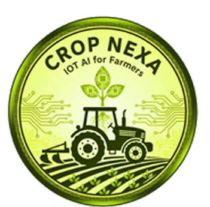
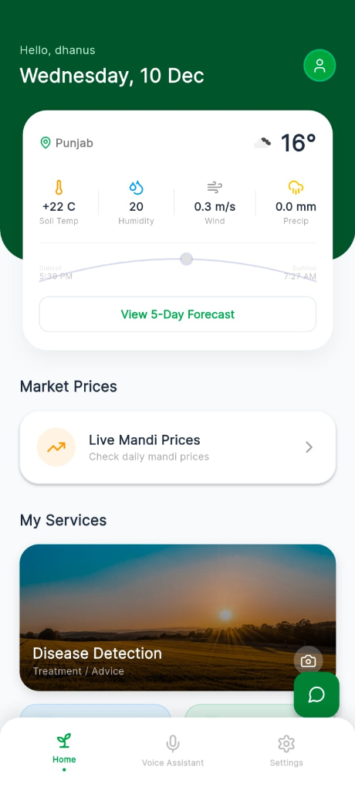
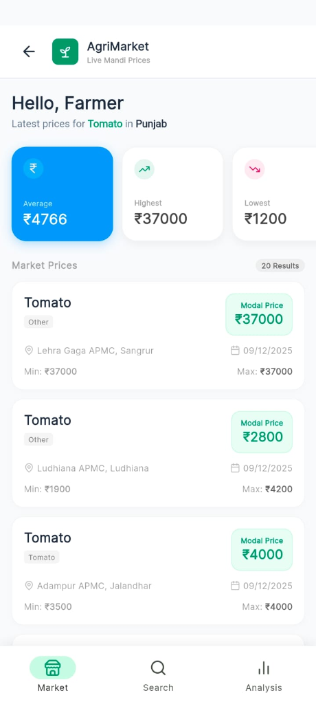
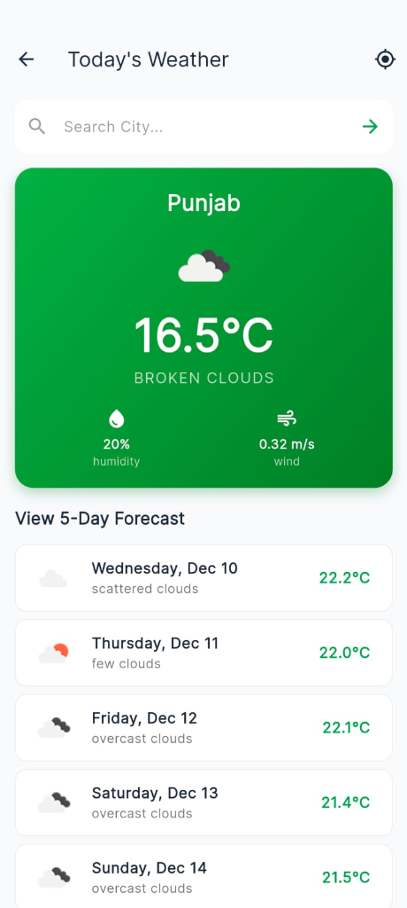
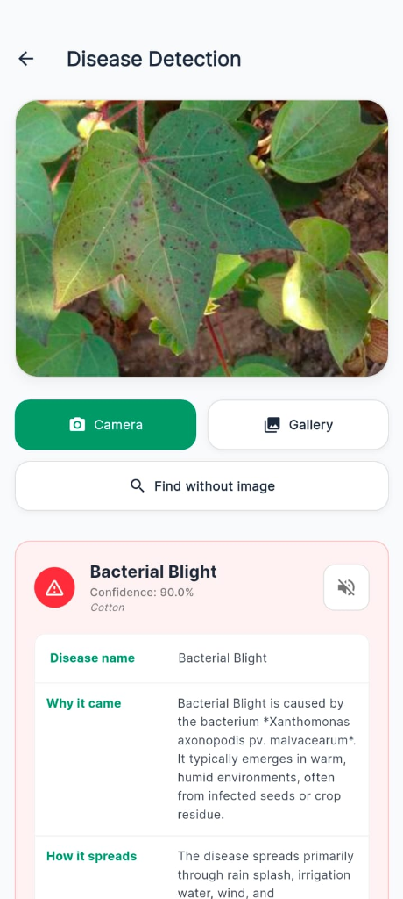
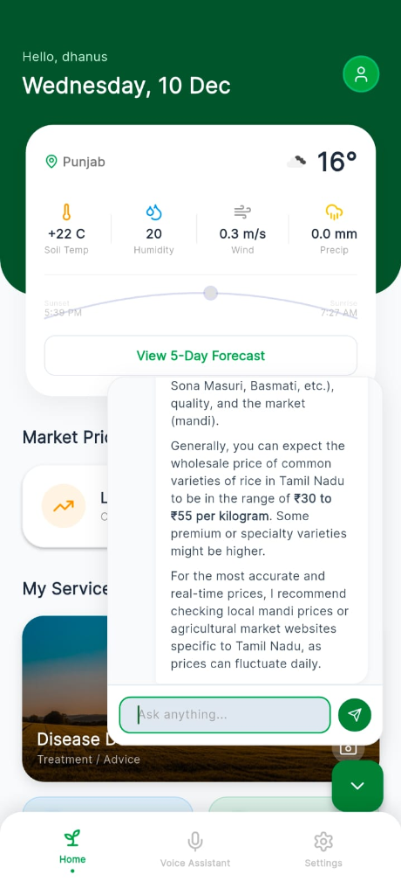

# Smart Farming App 🌾

A comprehensive mobile application presenting intelligent farming solutions, designed to address critical challenges like crop diseases, market volatility, and weather uncertainty using Gemini AI.



## 🚀 Key Features

*   **🌱 Disease Detection**: AI-powered plant disease detection using TensorFlow Lite and Gemini AI. Simply take a photo of the affected leaf to get an instant diagnosis and remedy.
*   **🤖 AI Chatbot (Agri-Bot)**: Conversational AI assistant powered by Google Gemini to answer farming queries in multiple languages.
*   **🌦️ Weather Updates**: Real-time weather forecasting to help plan farming activities.
*   **💰 Market Prices**: Live update of crop prices (Mandi rates) across different markets.
*   **🚜 Government Schemes**: Information about various government schemes beneficial for farmers.
*   **🗣️ Multi-language Support**: Full support for English, Hindi, Punjabi, and Tamil. Includes Text-to-Speech (TTS) and Speech-to-Text (STT) for accessibility.
*   **📊 Soil Health Analysis**: Tools to analyze soil health and recommend fertilizers (Integration with NPK sensors/data).

### 📱 App Screenshots

| **Home & Dashboard** | **Live Market Prices** | **Weather Forecast** |
|:---:|:---:|:---:|
|  |  |  |

| **Disease Detection** | **AI Agri-Chatbot** |
|:---:|:---:|
|  |  |

### ✨ Key Features in Detail

*   **🦠 AI Disease Detection**: Identify plant diseases like *Bacterial Blight* instantly by scanning a leaf. Powered by **Google Gemini AI** for accurate diagnosis and remedies.
*   **🛒 APMC Market (Mandi) Prices**: View real-time prices for crops like Tomato, Wheat, and Onion across different states (e.g., Punjab) and districts.
*   **🤖 Smart Chatbot**: Ask questions in your local language! (e.g., "Rice price in Tamil Nadu?") and get instant answers.
*   **🌦️ Precise Weather**: Get location-based weather updates, including temperature, rainfall, and 5-day forecasts.


## 🛠️ Tech Stack

*   **Framework**: [Flutter](https://flutter.dev/)
*   **Language**: Dart
*   **Backend & Auth**: Firebase (Auth, Firestore, Realtime Database)
*   **State Management**: Provider
*   **Localization**: `easy_localization`

## 🏁 Getting Started

### Prerequisites

*   Flutter SDK installed
*   Java Development Kit (JDK) 17
*   Android Studio / VS Code
*   API Keys (Gemini, OpenWeather, etc.)

### Installation

1.  **Clone the repository**
    ```bash
    git clone https://github.com/Dhanush-M2005/Smart-Farming-App.git
    cd Smart-Farming-App
    ```

2.  **Install dependencies**
    ```bash
    flutter pub get
    ```

3.  **Setup Environment Variables**
    Create a `.env` file in the root directory and add your API keys:
    ```env
    GEMINI_API_KEY=your_api_key_here
    # Add other keys as needed
    ```

4.  **Run the App**
    ```bash
    flutter run
    ```

## 📄 License

This project is licensed under the MIT License - see the [LICENSE](LICENSE) file for details.
